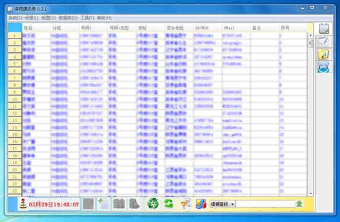

# ZeYuanADL 泽苑通讯录

泽苑通讯录是一款采用Java+Access开发,用于通讯录管理的软件.该软件提供添加、修改、删除通讯录，联系人分组、号码分组等常见通讯录管理功能,还提供了通讯录打印、邮件发送、启动QQ聊天、生日提醒、导入导出Excel等功能,此外为了管理方便,还提供了日记本、文件搜索等功能.该软件是第一次且是完全自主地软件开发尝试,从此本人对软件开发产生了浓厚的兴趣,一发不可收拾.

## 版本与更新

###　泽苑通讯录0.2.1

  已经发布地址：[下载地址](http://iask.sina.com.cn/u/1750490890/ish)   最新效果：

  桌面快捷方式：

  

  双击后，启动界面

  

  启动后，需要输入密码界面：

  

  密码输入错误提醒：

  主界面：

  状态栏：

  

鼠标经过表头提示：

    

  右键菜单：

  工具栏：

  （从左到右一次是：生日提醒，时钟，详细信息，新建，修改，删除，全部显示，刷新，筛选，统计，搜索，最小化到托盘）

  生日提醒：

  

  搜索“泽苑软件”的效果：

  

  回车一次，选定

  

  再连续两次回车：显示“详细信息”

  

  单击“删除”：

  

  单击“修改”：

  

  搜索“泽苑软件0”：

  

  没有搜索到结果，单击“新建”（搜索的姓名 自动作为 姓名）

  

  详细信息，单击 QQ图标，将启动QQ与他聊天：

  

  详细信息，单击 邮箱图标，启动聊天窗口：

  

  在选定项 右击菜单：

  

  在工具栏 单击“筛选按钮”，可以选择显示选定组，对选定组发送群邮件，启动分组管理。

  

  菜单：记录（新建，修改，删除，详细信息，分组管理）

  

  菜单：数据库（导入，从Excel导入，导出到同一张表，按分组导出到不同表，数据库初始化，创建空表，保存当前表）

  

  添加后“泽苑软件0”后，自动刷新

  

  菜单：选项，锁定

  

  分组管理

  

  系统选项：用户

  

  系统选项：设定软件风格

  

  系统选项：邮箱设置

  

  日记本

  

  桌面文件搜索：

  

  数据库格式化工具：

  

  历史版本：

  [泽苑通讯录0.2.0 下载地址](http://iask.sina.com.cn/u/1750490890/ish)

### 泽苑通讯录 0.2.1.1

  更新版本：[泽苑通讯录0.2.1.1](http://zeyuansoftware.blog.163.com/blog/static/17476153020116105727581/)

  主要的更新：

  1. 安全性，数据库严格加密处理，密码双重加密。

  2. 提高Excel导入和写入速度。

  3. 快捷的分组操作。

  4. 安装过程中直接产生桌面快捷方式。

  5. 增加手动设置数据库。

  6. 提高模糊查找速度。

  7. 减少对本地虚拟机的支持。

  泽苑通讯录0.2.1.1是对泽苑通讯录0.2.1的升级。主要的更新如下：

  

  登录界面

  

  配置文件完整性检查：

  

  数据库文件检查，发现数据库文件丢失。

  

  选择“是”，打开数据库选择选项。

  

  点击“浏览”弹出文件选择器：

  

  选择好数据库，打开选择的数据库。

  

  在没有数据库的情况下运行：

  

  快速修改分组：

  

  移动确认

  

  选择“是”后分组已经调整

  历时3天的紧张编写、编译，安装包终于制作完成。[下载地址](http://iask.sina.com.cn/u/1750490890/ish)
